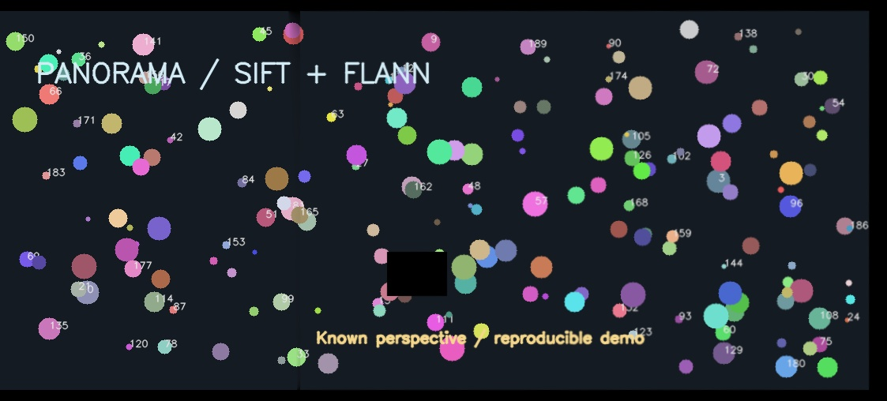
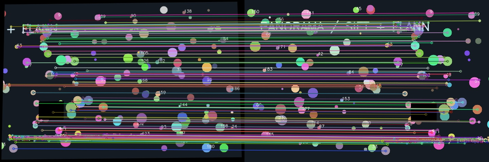

# Panoramik Matris Birleştirici

**İki örtüşen görüntünün ortak özelliklerini bulur, perspektiflerini hizalar ve tek bir panoramaya kaynaştırır.** Python ve OpenCV ile geliştirilen bu proje, SIFT → FLANN → RANSAC homografi → feather blending adımlarını açıkça uygular.

Hazır `cv2.Stitcher` çağrısı kullanılmaz: dönüşüm yönü, tuval sınırları, geçerlilik maskeleri ve kaynaştırma ağırlıkları kod içinde görülebilir.



> Bu görsel, projede üretilen sentetik test sahnesidir; gerçek fotoğraf performansının kanıtı değildir. Kendi fotoğraflarınızla çalıştırma komutu aşağıdadır.

## Hızlı başlangıç

Python 3.10–3.13 önerilir. Komutları proje klasöründe çalıştırın.

```bash
python -m venv .venv
```

Windows PowerShell:

```powershell
.venv\Scripts\Activate.ps1
```

macOS / Linux:

```bash
source .venv/bin/activate
```

```bash
python -m pip install -r requirements.txt
python main.py --left examples/left.png --right examples/right.png
```

Sonuçlar `outputs/` klasörüne yazılır. Ekran penceresi açılmadığından sunucu ve terminal ortamlarında da çalışır.

## Kendi fotoğraflarınla çalıştır

```bash
python main.py --left "fotograflar/sol.jpg" --right "fotograflar/sag.jpg" --output outputs/deneme
```

Aynı sahnenin yaklaşık %30–50 ortak alan içeren iki fotoğrafını kullanın. Kamerayı aynı noktadan döndürmek, sabit nesneleri çekmek ve benzer pozlama kullanmak daha iyi sonuç verir. Bu oran bir çekim önerisidir, algoritmanın garantisi değildir.

| Dosya | İçerik |
|---|---|
| `panorama.jpg` | Hizalanmış ve kaynaştırılmış sonuç |
| `matches.jpg` | RANSAC modelinin kabul ettiği eşleşmeler; sağ görüntü önce gösterilir |
| `metrics.json` | Özellik/eşleşme sayıları, inlier oranı, piksel hatası, süre ve homografi |



## Nasıl çalışır?

1. **SIFT:** Görüntüdeki ayırt edici noktaları ve çevrelerini temsil eden tanımlayıcı vektörleri çıkarır. Keypoint noktanın konumunu/ölçeğini, descriptor ise çevresinin sayısal temsilini içerir.
2. **FLANN + Lowe oran testi:** Sağ görüntüdeki her tanımlayıcı için soldaki iki yakın adayı bulur. `d1 < 0.75 × d2` koşulunu sağlayan eşleşmeler tutulur. Bu test belirsiz eşleşmeleri azaltır; doğruluğu garanti etmez.
3. **RANSAC + homografi:** Eşleşmelerden sağ → sol yönünde `3×3` dönüşüm matrisi hesaplar. Model ile tutarlı eşleşmeler **inlier**, tutarsız olanlar aykırı eşleşmedir. Homografi için en az dört, dejenere olmayan nokta çifti gerekir; bu uygulama güven için en az 12 aday ve 8 inlier ister.
4. **Tuval + warp:** İki görüntünün köşelerinden sonuç tuvali hesaplanır. Negatif koordinatlar öteleme matrisiyle tuvale taşınır; sağ görüntü `warpPerspective` ile bükülür.
5. **Kaynaştırma:** Ayrı geçerlilik maskeleri kullanılır; siyah içerik boş alan sanılmaz. Örtüşen alanda görüntü sınırına uzak pikseller daha fazla ağırlık alır. Boş dış çerçeve kırpılır; iç boşluklar doldurulmaz.

### Dönüşüm matematiği

```text
s × [x_sol, y_sol, 1]ᵀ = H × [x_sag, y_sag, 1]ᵀ
H_tuval = T × H
sonuc = (sol × agirlik_sol + sag × agirlik_sag) / toplam_agirlik
```

`s`, homojen koordinatların ölçek katsayısıdır. `T`, negatif koordinatları tuvale taşıyan ötelemedir. JSON içindeki `H` yeniden boyutlandırılmış girişlerin koordinatlarına aittir; orijinal tam çözünürlük koordinatlarına doğrudan uygulanmamalıdır.

## Ayarlar

| Parametre | Varsayılan | Etkisi |
|---|---:|---|
| `--ratio` | `0.75` | Küçültülürse eşleşme filtresi sıkılaşır |
| `--ransac` | `4.0` | İşlenen çözünürlükte RANSAC piksel hata eşiği |
| `--max-side` | `1400` | Her girişin en uzun kenarını sınırlar; küçük görseller büyütülmez |
| `--output` | `outputs` | Çıktı klasörü; aynı adlı dosyalar üzerine yazılır |

Çekirdek fonksiyonda tuval 12 milyon pikselle sınırlandırılmıştır. Bu bellek riskini azaltır; kesin RAM garantisi değildir. Geçersiz girdilerde açıklayıcı hata ve sıfırdan farklı çıkış kodu üretilir.

## Doğrulama

```bash
python -m unittest discover -s tests -v
```

Testler bilinen perspektif dönüşümünün geri bulunmasını, siyah içeriğin korunmasını, boş/alakasız görüntülerin reddini, tuval sınırını ve parametre doğrulamasını kontrol eder. Sentetik demo yeniden üretilebilir:

```bash
python demo.py
python main.py --left examples/left.png --right examples/right.png
```

Örnek çalıştırmanın ölçümleri `examples/metrics.json` dosyasındadır. Süre bilgisini kendi donanımınızda tekrar ölçün.

## Proje yapısı

```text
panorama-stitcher/
├── main.py                 # CLI, dosya okuma/yazma, raporlama
├── stitcher.py             # Özellik çıkarımı, eşleştirme, dönüşüm, blending
├── demo.py                 # Bilinen homografili sentetik sahne üretimi
├── requirements.txt        # Sabitlenmiş bağımlılıklar
├── examples/               # Girdiler, referans, sonuçlar ve ölçümler
└── tests/test_stitcher.py   # Başarı ve hata senaryoları
```

## Sınırlar ve sonraki adımlar

Tek homografi düzlemsel sahnelerde veya kamera aynı merkez etrafında döndüğünde daha uygundur. Yakın/uzak nesneler arasında paralaks, hareketli insanlar, tekrarlayan desenler, bulanıklık ve büyük pozlama farkları hatalara yol açabilir. Feather blending geçişi yumuşatır; hizalama hatasını, çift görüntüyü veya pozlama farkını tamamen çözmez. Her fotoğraf çiftinde kusursuz panorama beklenmemelidir.

Geliştirme fikirleri: pozlama dengeleme, dikiş hattı seçimi, multiband blending, silindirik projeksiyon ve çoklu fotoğraf desteği. Bunlar mevcut sürümde uygulanmamıştır.

## GitHub'a yükleme

GitHub'da `panorama-stitcher` adlı boş bir depo oluşturun. Otomatik README seçmeyin; bu README zaten projede var. ZIP dosyasını çıkarıp proje klasöründe aşağıdaki komutları çalıştırın. Adresin içindeki `KULLANICI_ADINIZ` bölümünü değiştirin.

```bash
git init
git add .
git commit -m "Implement SIFT panorama stitching with demo and tests"
git branch -M main
git remote add origin https://github.com/KULLANICI_ADINIZ/panorama-stitcher.git
git push -u origin main
```

Depo açıklaması önerisi: **SIFT, FLANN ve RANSAC homografi ile iki görüntüden panorama; maskeli feather blending, CLI ve tekrarlanabilir testler.**

Teslim öncesi kontrol: örnek görseller README'de açılıyor mu, kurulum yeni bir sanal ortamda çalışıyor mu, testler geçiyor mu ve depo bağlantısı öğretmeniniz tarafından erişilebilir mi? Kendi çektiğiniz iki fotoğrafla bir sonuç daha eklemek portföyü güçlendirir.

## Kaynaklar

- [OpenCV — SIFT](https://docs.opencv.org/4.x/da/df5/tutorial_py_sift_intro.html)
- [OpenCV — FLANN ile özellik eşleştirme](https://docs.opencv.org/4.x/d5/d6f/tutorial_feature_flann_matcher.html)
- [OpenCV — Özellik eşleştirme ve homografi](https://docs.opencv.org/4.x/d1/de0/tutorial_py_feature_homography.html)
- [OpenCV — Homografi açıklaması](https://docs.opencv.org/4.x/d9/dab/tutorial_homography.html)
